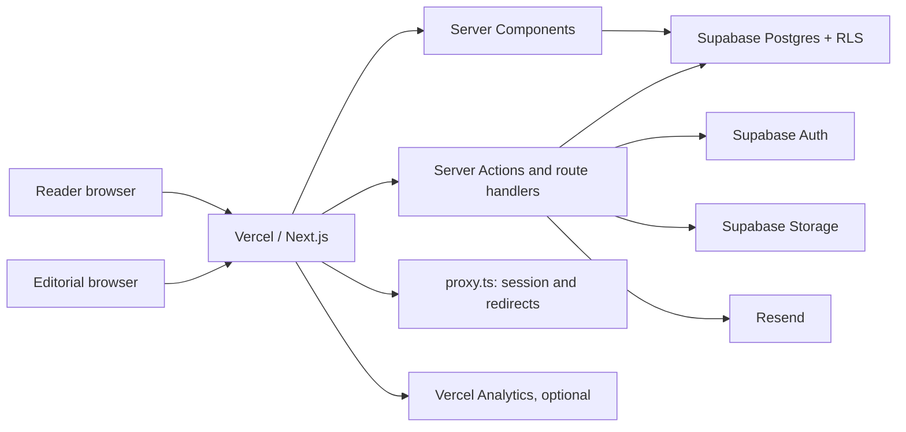
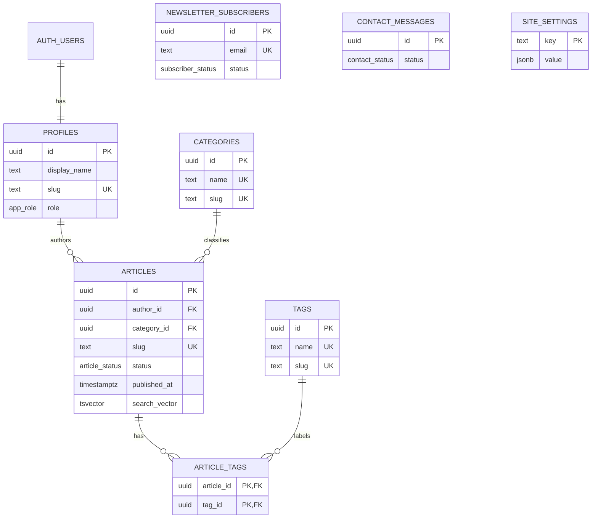
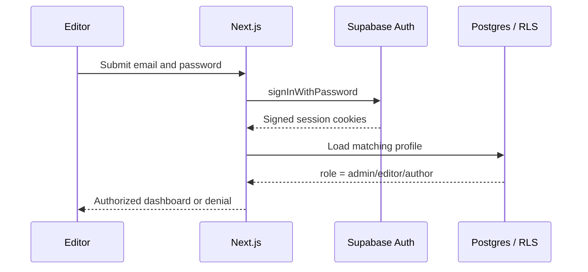

# Topicora Architecture

## System overview

Topicora is a Next.js App Router application. React Server Components perform most reads, while Server Actions and route handlers own mutations. Supabase provides authentication, PostgreSQL, and object storage. Resend is optional for transactional email; Vercel hosts the application and supplies optional privacy-conscious page analytics.

The service-role credential is imported only by server-only modules. Public reads use the anon key and are constrained by Row Level Security. Privileged actions first verify the authenticated profile and role, then use the minimum suitable client.

## Request and caching model

- Public pages are rendered on the server and use database queries with short Next.js revalidation windows.
- Editorial mutations call `revalidatePath` for the archive, homepage, article, taxonomy, and admin surfaces they affect.
- `POST /api/revalidate` is authenticated and lets staff invalidate a specific internal path.
- `proxy.ts` refreshes Supabase auth cookies. It also reads validated internal-only redirect rules from `site_settings`, cached for 60 seconds.
- Dynamic search, preview, and authenticated admin routes are request-driven and not treated as static content.
- Missing Supabase public configuration degrades the marketing shell and build safely rather than leaking or fabricating credentials.

## Data model

`private.form_rate_limits` lives in a schema unavailable to browser roles. A security-definer database function performs atomic rate checks for trusted server requests. Search vectors are generated and indexed with GIN. A partial unique index guarantees that only one article is featured.

## Authentication and authorization

Self-service signup is disabled. The bootstrap script creates an auth user using the service role; a database trigger creates its profile; the script promotes that profile to administrator. Public code cannot assign roles.

- `admin`: full CMS access, settings, deletion, subscriber management, and role-sensitive operations.
- `editor`: dashboard and editorial/taxonomy workflows, without administrator-only settings/deletion.
- `author`: represented in the data model and limited to their own eligible records; the current dashboard entry is deliberately restricted to administrators and editors.

Database RLS remains the final authorization boundary even if an application check is missed.

## Publishing and preview

Article visibility is defined by both status and time: `status = published` and `published_at <= now()`. Future-dated published records are therefore scheduled without requiring a cron job. They automatically become readable after the timestamp.

Preview requests require an authenticated administrator/editor. `/api/preview` creates an HMAC-SHA256 token containing the article ID and an expiry 15 minutes in the future. `/preview/[id]` verifies the signature with a timing-safe comparison and renders with `noindex`. The token secret is derived from the service-role key and never reaches a client bundle.

## Search

An article trigger maintains a weighted PostgreSQL `tsvector` from title, excerpt, and Markdown content. Public search validates and bounds the query, uses `websearch_to_tsquery`, orders by rank and recency, and only returns currently published rows under RLS. Search terms are highlighted at rendering time without injecting HTML.

## Forms and email

Public contact and newsletter endpoints use Zod validation, same-origin checks, hidden honeypot fields, minimum completion time, and database-backed IP/user-agent rate limiting. Contact messages are stored before optional delivery so an email outage does not lose the submission.

Newsletter subscribers begin as `pending`. A random confirmation token is emailed while only its SHA-256 hash is stored. The confirmation endpoint activates the record once; repeated confirmation remains safe. In local development, Supabase's mail viewer handles auth mail, and contact delivery can be omitted.

## Content and media safety

- Article input is stored as Markdown, not arbitrary HTML.
- The renderer uses GFM plus a strict sanitization schema; embedded HTML is never trusted.
- Storage accepts only JPEG, PNG, WebP, AVIF, and GIF under 5 MiB. SVG is intentionally rejected.
- Storage write policies require editorial roles; public read is limited to the article-media bucket.
- Cover-image alt text is enforced at both validation and database layers.

## Design tradeoffs

- Scheduled publication is query-time rather than cron-based. This is operationally simple and reliable, but exact cache refresh at the scheduled second depends on the active page's revalidation window.
- Redirects live in `site_settings` to avoid a deploy for editorial URL changes. Validation limits them to internal non-admin paths; large redirect sets should eventually move to an edge-native store.
- The database rate limiter is durable across serverless instances. At very large volume, an edge rate-limit service would reduce database load.
- Markdown keeps the CMS secure and portable. A block editor could improve authoring ergonomics later but adds migration and sanitization complexity.
- The local seed uses stable IDs for repeatability. Production editorial data should be migrated or imported through controlled operations, never by running a destructive reset.
